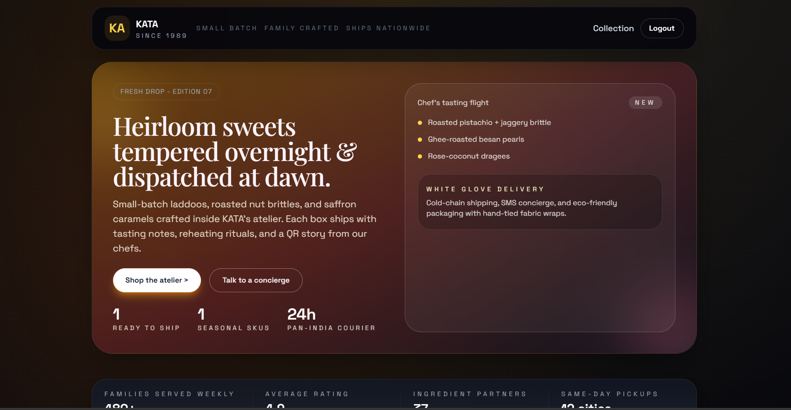
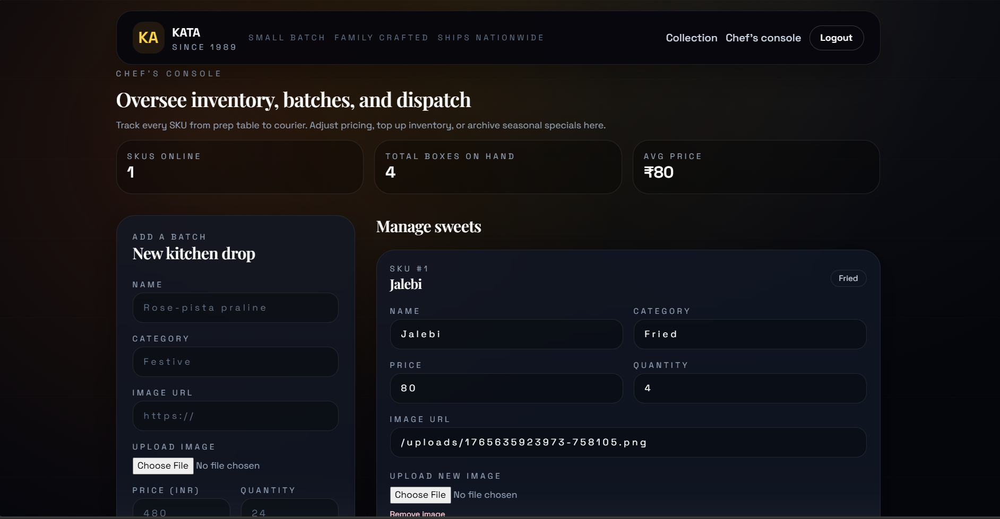

# Sweet Shop Management System

Enterprise-grade, full-stack TDD kata implementing a Sweet Shop Management System with an SQLite-backed REST API and modern React SPA.

## Overview
- Backend: Node.js, TypeScript, Express, `sql.js` (SQLite), JWT auth
- Frontend: React + Vite + TypeScript, Tailwind CSS, React Query
- Testing: Jest + Supertest (backend), Vitest (frontend)
- Database: SQLite file-based database (no external service required)

## Architecture
- Backend service in [backend](backend) with layered controllers/services and a lightweight repository layer in [backend/src/repositories](backend/src/repositories) powered by raw SQL via `sql.js`.
- Frontend SPA in [frontend](frontend) with routes/pages and API client.
- SQLite database is stored at `backend/data/sweetshop.db` - zero configuration needed.

## Prerequisites
- Node.js 18+

## Quick Start
1. Configure backend env:
- Copy [backend/.env.example](backend/.env.example) to `backend/.env` and adjust values if needed.
2. Install backend deps and run migrations:
```powershell
cd "c:\Users\hp\Desktop\Suhana Project\backend"
npm install
npm run db:migrate
npm run db:seed
```
3. Start backend API:
```powershell
cd "c:\Users\hp\Desktop\Suhana Project\backend"; npm run dev
```
4. Install frontend deps and run dev server:
```powershell
cd "c:\Users\hp\Desktop\Suhana Project\frontend"; npm install; npm run dev
```
5. Login with the seeded admin: `admin@example.com` / `adminpass`.

## Environment
- Backend config: [backend/.env.example](backend/.env.example)
  - `DATABASE_PATH=./data/sweetshop.db`
  - `JWT_SECRET=change_me`
  - `PORT=4000`

## Project Structure
```
Suhana Project/
├── backend/
│   ├── src/
│   │   ├── controllers/      # Express handlers
│   │   ├── services/         # Business logic (sync, sqlite-backed)
│   │   ├── repositories/     # Raw SQL helpers using sql.js
│   │   ├── middleware/       # Auth guards
│   │   └── db/               # sqlite init + migrations runner
│   ├── data/                 # sweetshop.db lives here
│   ├── uploads/              # Multer stores admin-uploaded images
│   └── tests/                # Jest + Supertest suites
├── frontend/
│   └── src/
│       ├── pages/            # Dashboard, Admin, Auth
│       ├── components/       # Hero, SweetCard, Cart, etc.
│       ├── api/              # Axios client with auth header
│       └── utils/            # Currency + image helpers
└── docs/
    └── running-from-scratch.md
```

## Developer Experience
- **Scripts (backend)**
  - `npm run dev` – start Express + sqlite in watch mode
  - `npm run db:migrate` – apply SQL migrations via sql.js
  - `npm run db:seed` – ensure default admin exists
  - `npm test` – Jest + Supertest with coverage
- **Scripts (frontend)**
  - `npm run dev` – Vite dev server with `/api` + `/uploads` proxy
  - `npm run build` – Production bundle
  - `npm test` – Vitest component/unit suites

## Image Uploads
- Admin console accepts either hosted URLs or local files.
- Local files are POSTed to `/api/uploads`, saved under `backend/uploads`, and served via `http://localhost:4000/uploads/...`.
- The frontend resolves `/uploads/*` paths automatically, so cards, spotlight, and testimonials display freshly uploaded imagery without extra config.

## API Endpoints
- Auth:
  - `POST /api/auth/register`
  - `POST /api/auth/login`
- Sweets (Protected):
  - `POST /api/sweets` (admin)
  - `GET /api/sweets`
  - `GET /api/sweets/search?name=&category=&minPrice=&maxPrice=`
  - `PUT /api/sweets/:id` (admin)
  - `DELETE /api/sweets/:id` (admin)
- Inventory (Protected):
  - `POST /api/sweets/:id/purchase`
  - `POST /api/sweets/:id/restock` (admin)

## Frontend Features
- Login/Register
- Immersive hero with concierge CTA and atelier storytelling
- Sweets dashboard with deep filters, seasonal spotlight, and social proof
- Live hamper/cart workflow with quantity controls and checkout call-to-action
- Pricing and receipts surfaced in INR to match the business context
- Purchase button (disabled at zero quantity)
- Testimonials + stats strip for authenticity
- Admin screens to add/update/delete/restock, now with curated image URLs per batch so storefront cards show real photography

## Screenshots
- Dashboard view: 
- Admin console: 

## TDD & Testing
- Backend tests:
```powershell
cd "c:\Users\hp\Desktop\Suhana Project\backend"; npm test
```
- Frontend tests: run
```powershell
cd "c:\Users\hp\Desktop\Suhana Project\frontend"; npm test
```
- Test report: see [docs/test-report.md](docs/test-report.md) for captured output and regenerate locally for verification (`npm test -- --coverage`).

## My AI Usage
- Tools: GitHub Copilot (GPT-5), ChatGPT (GPT-5.1-Codex Preview)
- Usage:
  - Copilot generated initial scaffolding for Express routes, repository helpers, and React components.
  - ChatGPT assisted in drafting tests, SQL migrations, and refactoring away from Prisma/Docker per new constraints.
- Reflection: AI accelerated boilerplate creation and helped reason through the ORM-to-SQL shift, while I remained responsible for security, data integrity, and verification.
